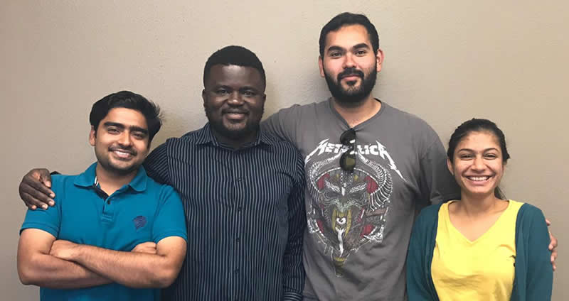
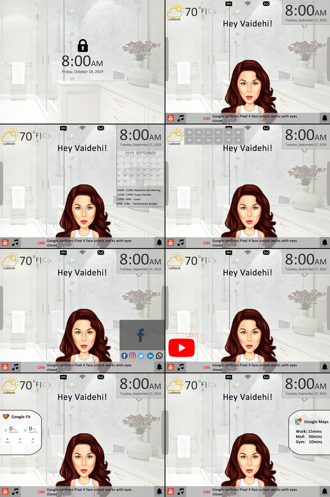

## Smart Mirror Design - Group 15

### Team Members & Responsibilites
### Sketch

<caption>Anubhav Tiwari (Developer); Ayodeji Ejiade (UI/UX Developer); Zacharias E. Alaniz (Team Leader); Vaidehi Piyush Pandya (Developer/QA Tester)</caption>

### Main Functions:
1. Facial Recognition
2. Date/Time , Calendar /Events, Weather Data 
3. Connecting to Smart Phone, Settings, Sleep and Health Data 
4. Messaging, Email, Music , Google Maps
5. Social Media, News Portal

### Implementation
<table width="100%">
<tr>
<th>Phase</th><th>Status</th><th>Next Steps</th>
</tr>

<tr>
<td>Requirement Gathering and Analysis</td><td>Completed</td><td></td>
</tr>

<tr>
<td>Design</td><td>Completed</td><td></td>
</tr>

<tr>
<td>Implementation or Coding</td><td>Working</td><td></td>
</tr>

<tr>
<td>Testing</td>In Progress<td></td><td></td>
</tr>

<tr>
<td>Deployment</td><td></td>TBA<td></td>
</tr>

</table>
