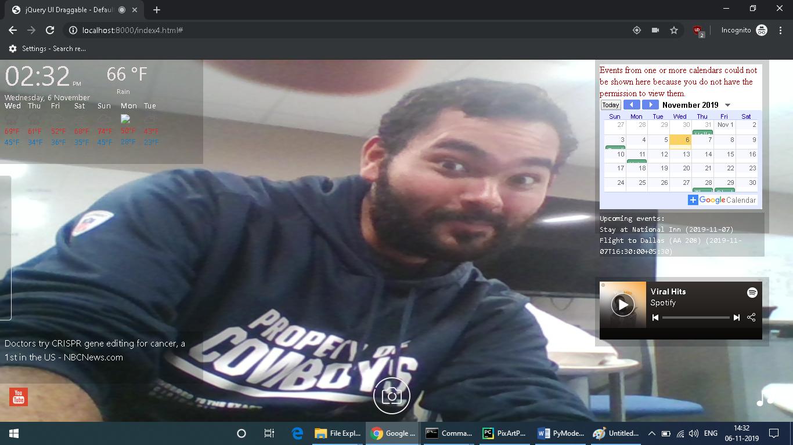

## Smart Mirror Design - Group 15

### Team Members & Responsibilites
### Sketch

<caption>Anubhav Tiwari (Developer); Ayodeji Ejiade (UI/UX Developer); Zacharias E. Alaniz (Team Leader); Vaidehi Piyush Pandya (Developer/QA Tester) Aneesha Baby(Developer)</caption>

### Implementation
<table width="100%">
<tr>
<th>Phase</th><th>Status</th><th>Next Steps</th>
</tr>

<tr>
<td>Requirement Gathering and Analysis</td><td>Completed</td><td>Design</td>
</tr>

<tr>
<td>Design</td><td>Completed</td><td>Implementation or Coding</td>
</tr>

<tr>
<td>Implementation or Coding</td><td> In progress</td><td>Testing</td>
</tr>

<tr>
<td>Testing</td><td>In progress</td><td>Deployment</td>
</tr>

<tr>
<td>Deployment</td><td>TBA</td><td>Presentation</td>
</tr>

</table>

- - - -
### The Focus of this product on the users' end. 
  * Age group: Young adults, Middle age Adults, and the Elderly. 
  * Gender Friendly
  * Language: English 
  * Education: Must have experience with a smart phone or tablet to use this device.
  * Cultural Background: Culture friendly* Job: For the common person
 - - - - 
### Novice users
  * User friendly 
  * simple to user
- - - - 
### Knowledegable users 
  * General knowledge and easy to use
  * Perform daily tasks with ease
- - - -
### Expert users 
* Familar with smart devices 
* task oriented
- - - -
### The Actions of the Smart mirror
* Watching youtube videos 
* Displays current location weather
* Plays a streaming music platform 
* Tells the time and Date
* Taking selfies 
- - - - 
Final Design:

- - - - 
Demo
